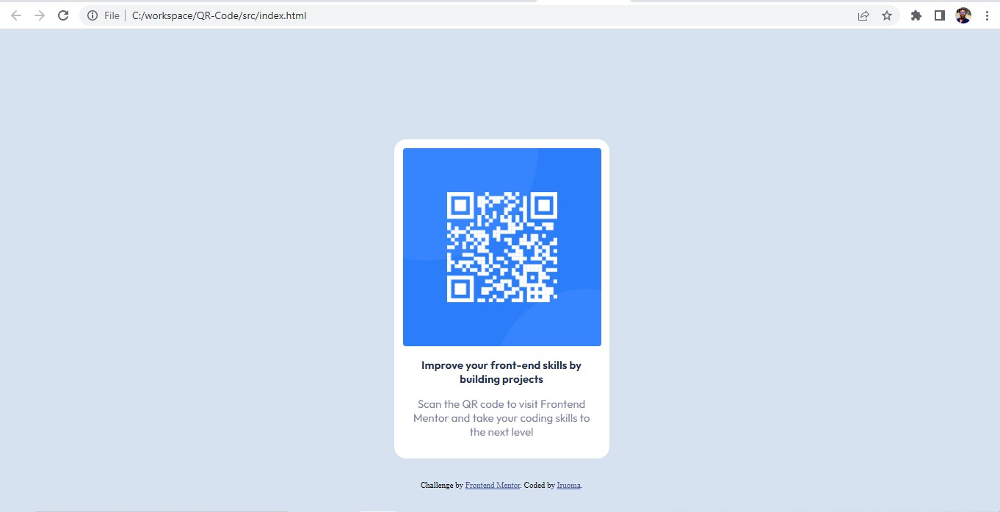

# Frontend Mentor - QR code component solution

This is a solution to the [QR code component challenge on Frontend Mentor](https://www.frontendmentor.io/challenges/qr-code-component-iux_sIO_H). Frontend Mentor challenges help you improve your coding skills by building realistic projects.

## Table of contents

- [Overview](#overview)
  - [Screenshot](#screenshot)
  - [Links](#links)
- [My process](#my-process)
  - [Built with](#built-with)
  - [What I learned](#what-i-learned)
  - [Continued development](#continued-development)
  - [Useful resources](#useful-resources)
- [Author](#author)

## Overview

This is my first attempt at writing a read me file. I don't enjoy writing, but I promise to do better subsequently.

### Screenshot

### Links

- Solution URL: [Add solution URL here](https://github.com/EnweremOma/QR-Code)
- Live Site URL: [Add live site URL here](https://omas-qr-037291.netlify.app/)

## My process

After creating my style sheet and organizing my colors, I started out with the background then I layered on it some kinda card using css.
Next was placing the image within the card and trying to eyeball my way to perfection.
I worked on the fonts last to adjust them to required size.

### Built with

- HTML
- CSS

### What I learned

I learned that coding never really leaves you, you just get rusty. I picked up this newbie challange to refresh my memory and I'm glad i did.

### Continued development

A lot of users access the websites with their mobile phones and that makes media querries supper important. With my observation from this challange, my media querries knowledge could use some revamp.  
For someone enclined to the front end, my speed was really poor. Yes i can attribute them to a couple other factors but I could do better. I intend to pick up a JavaScript program and battle through.

### Useful resources

- [Example resource 1](https://www.W3Schools.com) - This helped me refresh my knowledge of CSS. I really liked this pattern and will use it going forward.

## Author

- Website - [Iruoma](https://omas-qr-037291.netlify.app/)
- Frontend Mentor - [@EnweremOma](https://www.frontendmentor.io/profile/EnweremOma)
- Twitter - [@fave_oma](https://www.twitter.com/fave_oma)
